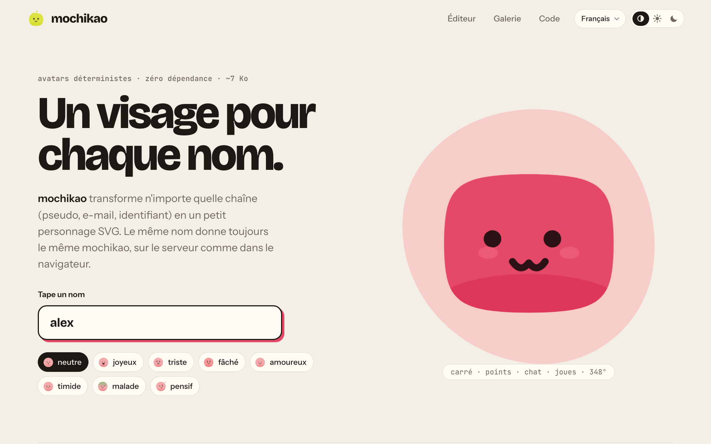
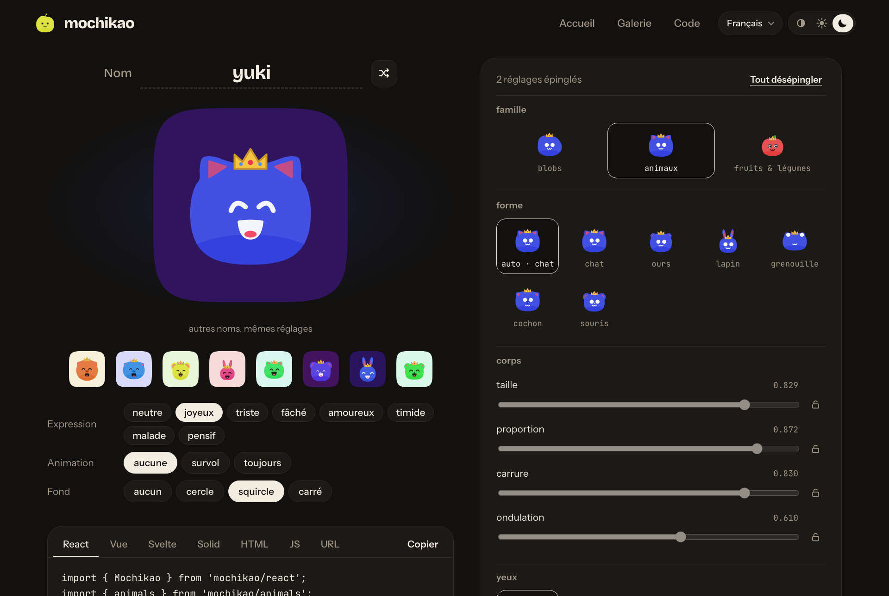

# mochikao

Un visage pour chaque nom. `mochikao` transforme n'importe quelle chaîne (pseudo, e-mail, id) en un petit personnage SVG. Le même nom donne toujours le même mochikao.





- **Déterministe** : `cyrb53` → `mulberry32`, aucun appel réseau, aucun état.
- **Zéro dépendance**, ~7 Ko min+gzip.
- **10 formes de blobs**, et deux familles optionnelles importées à part : 6 animaux (`mochikao/animals`, +1,1 Ko) et 6 fruits & légumes (`mochikao/produce`, +1,5 Ko, avec leur teinte naturelle).
- 5 yeux, 6 bouches, 11 accessoires (joues, taches, antenne, pousse, reflet, lunettes, lunettes noires, nœud, couronne, chapeau de fête).
- **10 axes continus** réglables (taille et proportion du corps, carrure, ondulation, taille/écart/inclinaison des yeux, regard x/y, taille de la bouche) et 6 préréglages de couleur.
- **8 expressions** : `idle`, `happy`, `sad`, `mad`, `love`, `shy`, `sick`, `thinking`.
- **Contraste visage/corps ≥ 4.5:1** pour toute teinte et tout ton (vérifié par les tests).
- **Animations CSS** (respiration, clignement, coups d'œil), **transition animée entre expressions** et **regard qui suit le pointeur**.
- Fonction, composants **React / Vue / Svelte / Solid**, web component, API HTTP et CLI.

Inspiré de [blobatar](https://blobatar.dev).

## Démarrer

```bash
npm install
npm run dev        # site (accueil + /editor.html) sur http://localhost:5173, API /api/*.svg branchée
npm test           # tests node:test
npm run api        # API seule sur :8787
npm run build      # lib + CLI dans dist/
npm run build:site # site statique dans dist-site/
```

Pour développer, Node ≥ 22.18 : les sources `.ts` s'exécutent directement (type stripping). Le paquet publié, lui, est du JavaScript ES2022 (ESM) : Node ≥ 20 et tous les bundlers. Les tests utilisent la condition d'export `mochikao-source` pour importer le package depuis ses sources, sans build préalable.

## Utilisation

### Fonction

```ts
import { mochikao, resolve } from 'mochikao';

const svg = mochikao({ name: 'alex@mail.com', size: 64, background: 'squircle' });
resolve('alex'); // { shape: 'boxy', eyes: 'dot', mouth: 'cat', extra: 'none', hue: 348, colors: {...} }
```

| Option | Valeurs | Défaut |
| --- | --- | --- |
| `name` | toute chaîne (insensible à la casse et aux espaces autour) | — |
| `size` | px | `128` |
| `background` | `none` `circle` `squircle` `square` | `none` |
| `hue` | 0–360 | tirée du nom |
| `tone` | 0 (sombre) – 1 (clair) | `0.5` |
| `saturation` | 0–1 | `0.74` |
| `color` | préréglage ton + saturation : `pastel` `pale` `mid` `deep` `bright` `ink` | — |
| `family` | une famille importée : `animals`, `produce` (voir plus bas) | blobs |
| `expression` | `idle` `happy` `sad` `mad` `love` `shy` `sick` `thinking` | `idle` |
| `animate` | `none` `hover` `always` | `none` |
| `shape` `eyes` `mouth` `extra` | épingle un trait par son nom (`shape` parmi les formes de la famille) | tirés du nom |
| `traits` | épingle des axes 0–1 : `bodySize` `proportion` `squareness` `wobble` `eyeSize` `spacing` `lean` `gazeX` `gazeY` `mouthSize` | tirés du nom |
| `gaze` | ajoute le CSS de suivi du regard (`--gx`, `--gy`) | `false` |

`toParams(options)` (depuis `mochikao/params`) donne les mêmes options en paramètres d'URL, et `parseParams` fait l'inverse : c'est ce qu'utilisent l'API, la CLI, le web component et les liens de l'éditeur.

`mochikaoDataUri(options)` renvoie la même image en data URI, encodée au plus court pour un attribut HTML. `mochikaoImage(options)` renvoie directement `{ src, width, height, alt }`.

Épingler un axe ne change pas les autres : on peut forcer la forme sans perdre la couleur ni le visage.

### React, Vue, Svelte, Solid

```tsx
import { Mochikao } from 'mochikao/react';      // React 18+ (et Preact via preact/compat)
<Mochikao name="alex" size={48} animate="hover" className="avatar" />
```

```vue
<script setup>
import { Mochikao } from 'mochikao/vue';        // Vue 3.3+
</script>
<template>
  <Mochikao name="alex" :size="48" animate="hover" />
</template>
```

```svelte
<script>
  import Mochikao from 'mochikao/svelte';       // Svelte 5
</script>
<Mochikao name="alex" size={48} animate="hover" />
```

```tsx
import { Mochikao } from 'mochikao/solid';      // Solid 1.8+
<Mochikao name="alex" size={48} animate="hover" class="avatar" />
```

Mêmes props que les options de `mochikao()` (sauf `gaze`), plus `inline`. Les autres attributs (`class`, `style`, événements...) sont transmis à l'élément rendu. Le composant React n'utilise aucun hook et fonctionne donc en Server Component. Les frameworks sont des `peerDependencies` optionnelles : seul celui que tu importes est requis.

**`` ou SVG en ligne ?** Sans animation, les composants rendent un simple `` : 1 nœud DOM au lieu d'une vingtaine (18 à 27 selon l'avatar), ce qui compte dans les longues listes. Avec `animate="hover"` ou `"always"`, ils rendent le SVG en ligne, nécessaire pour que l'animation fonctionne. `inline` force le SVG en ligne, par exemple pour le styler en CSS. Le web component suit la même règle, et passe aussi en SVG en ligne avec `gaze`.

Le composant Svelte est livré en `.svelte` source, compilé par ton bundler (condition d'export `svelte`). Le composant Solid est écrit sans JSX : pas besoin du plugin Babel de Solid pour le consommer, et toutes les props restent réactives.

### Familles de formes

mochikao n'embarque que les blobs. Les autres familles sont des modules à importer et à passer en option, pour que seuls ceux qui s'en servent en paient le poids :

```ts
import { mochikao } from 'mochikao';
import { animals } from 'mochikao/animals';   // chat, ours, lapin, grenouille, cochon, souris
import { produce } from 'mochikao/produce';   // pomme, poire, fraise, citron, carotte, avocat

mochikao({ name: 'alex', family: animals });
mochikao({ name: 'alex', family: produce, shape: 'lemon' });
```

Choisir une famille ne change que la forme : yeux, bouche, accessoire et réglages restent ceux du nom. Là où les options arrivent en texte (attributs HTML, URL, CLI), on déclare les familles disponibles une fois : `defineMochikao({ families: [animals] })` puis `<mochikao-avatar family="animals">`, ou `parseParams(nom, params, [animals, produce])`. L'API et la CLI fournies acceptent les deux.

Une famille, c'est un objet `ShapeFamily` (`name`, `shapes`, `silhouette`, et en option `decorate` et `hue`) : `src/families/` montre comment en écrire une.

### Transition entre expressions

En SVG en ligne (`animate`, `inline` ou `gaze`), changer `expression` déclenche une petite transition : les yeux clignent, la bouche se referme, le visage change pendant qu'ils sont fermés, puis tout se rouvre avec un rebond (~450 ms). Les composants et le web component le font tout seuls. Un `` ne peut pas s'animer : en mode image, le changement est immédiat.

Pour ton propre rendu, `morphTo(element, svg)` (depuis `mochikao/morph`) remplace le SVG contenu dans `element` avec la transition. Elle ne s'applique qu'entre deux expressions du même personnage (attribut `data-mochikao` identique) ; sinon, ou si `prefers-reduced-motion` est actif, le remplacement est direct. Un appel pendant une transition repart de l'état affiché, sans étape intermédiaire.

### Web component

```html
<script type="module">
  import { defineMochikao } from 'mochikao/element';
  defineMochikao();
</script>

<mochikao-avatar name="alex" animate="hover" background="circle" gaze></mochikao-avatar>
```

Mêmes attributs que les options ; `gaze` fait suivre le pointeur aux yeux.

### API HTTP

```
GET /api/<nom>.svg?size=&bg=&hue=&tone=&expression=&animate=&shape=&eyes=&mouth=&extra=
```

Réponse `image/svg+xml` avec `Cache-Control: immutable` (même entrée → même sortie). Les paramètres invalides sont ignorés. Le handler (`api/handler.ts`) est une simple fonction `(req, res)` de `node:http`, à brancher où tu veux.

### CLI

```bash
npx mochikao alex --bg circle --expression happy -o alex.svg
npx mochikao alex --info   # traits et couleurs en JSON
```

## Site

- **Accueil** : nom à taper, expressions, familles, galerie, exemples de code.
- **Éditeur** (`/editor.html`) : épingle chaque trait (grilles avec aperçus, curseurs avec cadenas), vois le résultat sur d'autres noms, récupère le code (React, Vue, Svelte, Solid, HTML, JS, URL), télécharge en SVG/PNG. L'URL de la page reflète la config : copier le lien suffit pour la partager.
- **Thème** clair / sombre / système (mémorisé, sans flash au chargement) et **langues** français, anglais, espagnol, japonais (`?lang=en`, sinon la langue du navigateur).

## Stabilité

La constante `GENERATION` (`src/traits.ts`) et l'ordre des tirages font partie de la graine. Les changer modifie **tous** les avatars, donc toutes les URL déjà publiées. Le test « les traits de "alex" ne bougent pas » sert de garde-fou.

## Structure

```
src/
  random.ts   hachage cyrb53 + PRNG mulberry32
  traits.ts   axes, listes de traits, dérivation depuis le nom
  shape.ts    silhouettes (fonctions polaires → Catmull-Rom → Bézier)
  color.ts    palette HSL avec contraste garanti
  face.ts     yeux, bouches, sourcils, accessoires, expressions
  index.ts    rendu SVG + animations
  params.ts   options depuis query string / attributs / flags
  family.ts   contrat d'une famille de formes (ShapeFamily)
  families/   animals.ts, produce.ts (modules à part) et kit.ts (outils communs)
  morph.ts    transition animée entre expressions (Web Animations)
  element.ts  <mochikao-avatar>
  react.ts    composant React
  vue.ts      composant Vue
  solid.ts    composant Solid
  svelte/     composant Svelte (livré en source)
api/          handler HTTP + serveur Node
bin/          CLI
site/         accueil + éditeur (Vite) ; site/shared : thème clair/sombre, traductions fr/en/es/ja
test/         node:test
```

## Publier

Un seul paquet, `mochikao`, sert npm, pnpm, yarn et bun : ils installent tous depuis le registre npm. Les intégrations sont des sous-chemins (`mochikao/react`, `mochikao/animals`...), et React, Vue, Svelte et Solid sont des `peerDependencies` optionnelles.

**Première version, à la main** (le paquet doit exister avant d'activer la publication automatique) :

```bash
npm pack --dry-run      # liste exacte des fichiers envoyés
npm login
npm publish             # prepublishOnly lance types, tests et build avant
```

**Versions suivantes, par la CI** (`.github/workflows/release.yml`, Trusted Publishing : aucun jeton npm, preuve d'origine automatique) :

1. Sur npmjs.com, dans les réglages du paquet : ajouter GitHub Actions comme *trusted publisher* (dépôt, workflow `release.yml`, environnement `npm`), puis « Require two-factor authentication and disallow tokens ».
2. Pour publier :
   ```bash
   npm version patch          # ou minor / major : met à jour package.json et crée le tag
   git push --follow-tags     # le tag vX.Y.Z déclenche la publication
   ```

La CI (`.github/workflows/ci.yml`) vérifie types, tests et builds sur Node 22 et 24 à chaque push et pull request, plus l'audit des dépendances publiées et publint.

Une fois publié, le rendu des avatars est un contrat : voir Stabilité.

## Licence

MIT
