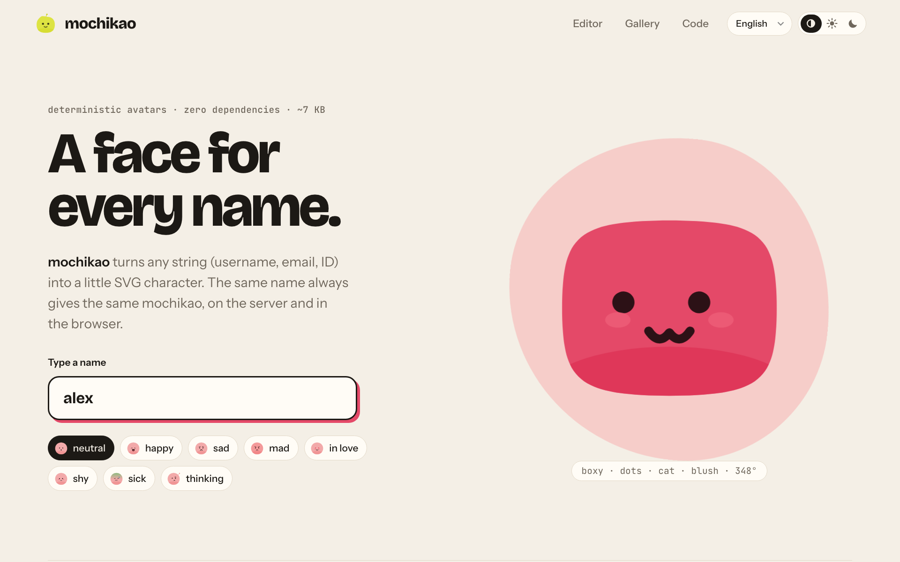
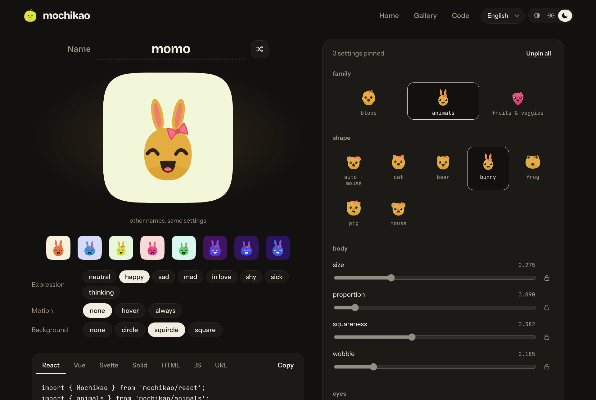

# mochikao

**English** · [Français](README.fr.md)

A face for every name. `mochikao` turns any string (username, email, ID) into a little SVG character. The same name always gives the same mochikao.





- **Deterministic**: `cyrb53` → `mulberry32`, no network calls, no state.
- **Zero dependencies**, ~7 KB min+gzip.
- **10 blob shapes**, plus two optional families imported separately: 6 animals (`mochikao/animals`, +1.1 KB) and 6 fruits & veggies (`mochikao/produce`, +1.5 KB, each with its natural color).
- 5 eyes, 6 mouths, 11 accessories (blush, freckles, antenna, sprout, shine, glasses, sunglasses, bow, crown, party hat).
- **10 continuous axes** you can tune (body size and proportion, squareness, wobble, eye size/spacing/lean, gaze x/y, mouth size) and 6 color presets.
- **8 expressions**: `idle`, `happy`, `sad`, `mad`, `love`, `shy`, `sick`, `thinking`.
- **Face-to-body contrast ≥ 4.5:1** for every hue and tone (checked by the tests).
- **CSS animations** (breathing, blinking, glances), **animated transitions between expressions** and **eyes that follow the pointer**.
- A function, **React / Vue / Svelte / Solid** components, a web component, an HTTP API and a CLI.

Inspired by [blobatar](https://blobatar.dev).

## Getting started

```bash
npm install
npm run dev        # site (home + /editor.html) on http://localhost:5173, with the /api/*.svg API
npm test           # node:test tests
npm run api        # API alone on :8787
npm run build      # library + CLI into dist/
npm run build:site # static site into dist-site/
```

Development needs Node ≥ 22.18: the `.ts` sources run directly (type stripping). The published package is plain ES2022 JavaScript (ESM): Node ≥ 20 and every bundler. The tests use the `mochikao-source` export condition to import the package from its sources, with no build step.

## Usage

### Function

```ts
import { mochikao, resolve } from 'mochikao';

const svg = mochikao({ name: 'alex@mail.com', size: 64, background: 'squircle' });
resolve('alex'); // { shape: 'boxy', eyes: 'dot', mouth: 'cat', extra: 'blush', hue: 348, colors: {...} }
```

| Option | Values | Default |
| --- | --- | --- |
| `name` | any string (case-insensitive, surrounding spaces ignored) | — |
| `size` | px | `128` |
| `background` | `none` `circle` `squircle` `square` | `none` |
| `hue` | 0–360 | from the name |
| `tone` | 0 (dark) – 1 (light) | `0.5` |
| `saturation` | 0–1 | `0.74` |
| `color` | tone + saturation preset: `pastel` `pale` `mid` `deep` `bright` `ink` | — |
| `family` | an imported family: `animals`, `produce` (see below) | blobs |
| `expression` | `idle` `happy` `sad` `mad` `love` `shy` `sick` `thinking` | `idle` |
| `animate` | `none` `hover` `always` | `none` |
| `shape` `eyes` `mouth` `extra` | pin a trait by name (`shape` among the family's shapes) | from the name |
| `traits` | pin 0–1 axes: `bodySize` `proportion` `squareness` `wobble` `eyeSize` `spacing` `lean` `gazeX` `gazeY` `mouthSize` | from the name |
| `gaze` | adds the CSS for pointer tracking (`--gx`, `--gy`) | `false` |

`toParams(options)` (from `mochikao/params`) turns the same options into URL parameters, and `parseParams` does the reverse: that is what the API, the CLI, the web component and the editor links use.

`mochikaoDataUri(options)` returns the same image as a data URI, encoded as compactly as possible for an HTML attribute. `mochikaoImage(options)` returns `{ src, width, height, alt }` directly.

Pinning one axis leaves the others alone: you can force the shape without losing the color or the face.

### React, Vue, Svelte, Solid

```tsx
import { Mochikao } from 'mochikao/react';      // React 18+ (and Preact via preact/compat)
<Mochikao name="alex" size={48} animate="hover" className="avatar" />
```

```vue
<script setup>
import { Mochikao } from 'mochikao/vue';        // Vue 3.3+
</script>
<template>
  <Mochikao name="alex" :size="48" animate="hover" />
</template>
```

```svelte
<script>
  import Mochikao from 'mochikao/svelte';       // Svelte 5
</script>
<Mochikao name="alex" size={48} animate="hover" />
```

```tsx
import { Mochikao } from 'mochikao/solid';      // Solid 1.8+
<Mochikao name="alex" size={48} animate="hover" class="avatar" />
```

Same props as the `mochikao()` options (except `gaze`), plus `inline`. Other attributes (`class`, `style`, event handlers…) are passed to the rendered element. The React component is a client component (`'use client'`, for the expression transition): it still renders on the server and can be used from Server Components. The frameworks are optional `peerDependencies`: only the one you import is required.

**`` or inline SVG?** Without animation, the components render a plain ``: 1 DOM node instead of about twenty (18 to 27 depending on the avatar), which matters in long lists. With `animate="hover"` or `"always"`, they render inline SVG, which the animation needs. `inline` forces inline SVG, for example to style it with CSS. The web component follows the same rule, and also switches to inline SVG with `gaze`.

The Svelte component ships as a `.svelte` source file, compiled by your bundler (`svelte` export condition). The Solid component is written without JSX: no Solid Babel plugin needed to consume it, and every prop stays reactive.

### Shape families

mochikao only bundles the blobs. The other families are modules you import and pass as an option, so only the people who use them pay for their size:

```ts
import { mochikao } from 'mochikao';
import { animals } from 'mochikao/animals';   // cat, bear, bunny, frog, pig, mouse
import { produce } from 'mochikao/produce';   // apple, pear, strawberry, lemon, carrot, avocado

mochikao({ name: 'alex', family: animals });
mochikao({ name: 'alex', family: produce, shape: 'lemon' });
```

Picking a family only changes the shape: eyes, mouth, accessory and settings still come from the name. Where options arrive as text (HTML attributes, URLs, CLI), declare the available families once: `defineMochikao({ families: [animals] })` then `<mochikao-avatar family="animals">`, or `parseParams(name, params, [animals, produce])`. The bundled API and CLI accept both.

A family is a `ShapeFamily` object (`name`, `shapes`, `silhouette`, and optionally `decorate` and `hue`): `src/families/` shows how to write one.

### Transitions between expressions

With inline SVG (`animate`, `inline` or `gaze`), changing `expression` plays a short transition: the eyes blink, the mouth closes, the face changes while they are shut, then everything reopens with a little bounce (~450 ms). The components and the web component do it on their own. An `` cannot animate: in image mode the change is immediate.

For your own rendering, `morphTo(element, svg)` (from `mochikao/morph`) replaces the SVG inside `element` with the transition. It only applies between two expressions of the same character (same `data-mochikao` attribute); otherwise, or when `prefers-reduced-motion` is on, the replacement is instant. A call during a transition starts again from what is on screen, with no intermediate step.

### Web component

```html
<script type="module">
  import { defineMochikao } from 'mochikao/element';
  defineMochikao();
</script>

<mochikao-avatar name="alex" animate="hover" background="circle" gaze></mochikao-avatar>
```

Same attributes as the options; `gaze` makes the eyes follow the pointer.

### HTTP API

```
GET /api/<name>.svg?size=&bg=&hue=&tone=&color=&expression=&animate=&family=&shape=&eyes=&mouth=&extra=
```

Responds with `image/svg+xml` and `Cache-Control: immutable` (same input → same output). Invalid parameters are ignored. The handler (`api/handler.ts`) is a plain `node:http` `(req, res)` function you can mount anywhere.

### CLI

```bash
npx mochikao alex --bg circle --expression happy -o alex.svg
npx mochikao alex --info   # traits and colors as JSON
```

## Site

- **Home**: type a name, try expressions, browse the families and the gallery, copy code examples.
- **Editor** (`/editor.html`): pin each trait (grids with previews, sliders with locks), see the result on other names, get the code (React, Vue, Svelte, Solid, HTML, JS, URL), download as SVG/PNG. The page URL holds the config: copying the link is enough to share it.
- **Light / dark / system theme** (remembered, no flash on load) and **languages**: English, French, Spanish, Japanese (`?lang=en`, otherwise the browser language).

## Stability

The `GENERATION` constant (`src/traits.ts`) and the order of the random draws are part of the seed. Changing them changes **every** avatar, and so every URL already in use. The "alex's traits do not move" test guards against that.

## Project structure

```
src/
  random.ts   cyrb53 hash + mulberry32 PRNG
  traits.ts   axes, trait lists, derivation from the name
  shape.ts    silhouettes (polar functions → Catmull-Rom → Bézier)
  color.ts    HSL palette with guaranteed contrast
  face.ts     eyes, mouths, brows, accessories, expressions
  index.ts    SVG rendering + animations
  params.ts   options from query strings / attributes / flags
  family.ts   shape family contract (ShapeFamily)
  families/   animals.ts, produce.ts (separate modules) and kit.ts (shared helpers)
  morph.ts    animated transitions between expressions (Web Animations)
  element.ts  <mochikao-avatar>
  react.ts    React component
  vue.ts      Vue component
  solid.ts    Solid component
  svelte/     Svelte component (shipped as source)
api/          HTTP handler + Node server
bin/          CLI
site/         home + editor (Vite); site/shared: light/dark theme, en/fr/es/ja translations
test/         node:test
```

## Publishing

A single package, `mochikao`, serves npm, pnpm, yarn and bun: they all install from the npm registry. The integrations are subpaths (`mochikao/react`, `mochikao/animals`…), and React, Vue, Svelte and Solid are optional `peerDependencies`.

**First release, by hand** (the package has to exist before automated publishing can be turned on):

```bash
npm pack --dry-run      # exact list of the files that will be published
npm login
npm publish             # prepublishOnly runs types, tests and build first
```

**Later releases, from CI** (`.github/workflows/release.yml`, Trusted Publishing: no npm token, provenance attached automatically):

1. On npmjs.com, in the package settings: add GitHub Actions as a *trusted publisher* (repository, workflow `release.yml`, environment `npm`), then pick "Require two-factor authentication and disallow tokens".
2. To publish:
   ```bash
   npm version patch          # or minor / major: updates package.json and creates the tag
   git push --follow-tags     # the vX.Y.Z tag triggers the release
   ```

CI (`.github/workflows/ci.yml`) checks types, tests and builds on Node 22 and 24 for every push and pull request, plus an audit of the published dependencies and publint.

Once published, the avatars' rendering is a contract: see Stability.

## License

MIT
